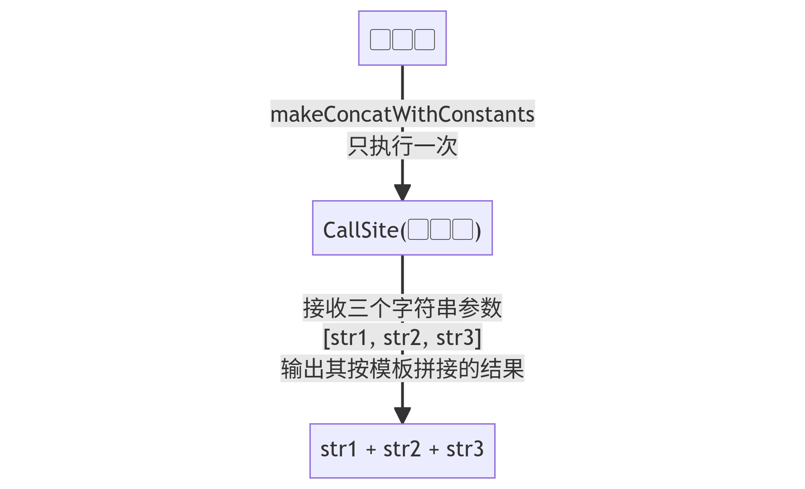

## 前言：误区

前段时间看到了这篇文章《[写出漂亮代码的45个小技巧 - zzyang90 - 掘金](https://juejin.cn/post/7156754418929500168#heading-42)》。
文章提出我们应该把 `a + b + c` 用 `stringBuilder.append(a).append(b).append(c).toString()` 来代替。
从“漂亮代码”的层面上，当然是前者更友好；而从性能层面上，后者真的效率有提高吗？

---

本文将会包含以下内容：

- 性能测试工具部分
    - 使用 [Java Microbenchmark Harness (JMH)](https://github.com/openjdk/jmh) 进行性能测试
    - 使用 `-prof gc` 选项来查看性能测试时的 GC 相关指标
- `StringBuilder` 重复使用的性能测试
- Java 9 [JEP 280: Indify String Concatenation] 的介绍
    - 与 `StringBuilder, String::join` 的性能对比测试以及原因分析
    - Java 9 字符串压缩的简单介绍

[JEP 280: Indify String Concatenation]: https://openjdk.org/jeps/280

## JMH 介绍

[JMH](https://github.com/openjdk/jmh) 是用来在 JVM 上进行微型性能测试（microbenchmark）的工具。想看看 `i % 2` 和 `i & 1` 速度到底差多少？想知道 `StringBuilder` 到底性能如何？不要再手动 `System.nanoTime()` 了，请用JMH。

按官方步骤，我们先生成一个项目：

```console
$ mvn archetype:generate \
  -DinteractiveMode=false \
  -DarchetypeGroupId=org.openjdk.jmh \
  -DarchetypeArtifactId=jmh-java-benchmark-archetype \
  -DgroupId=org.sample \
  -DartifactId=stringbuilder-test \
  -Dversion=1.0
```

进入生成的 `stringbuilder-test` 目录后，我们使用 `mvn clean verify` 来生成用于测试的 `target/benchmarks.jar`。
当然，现在我们什么测试代码都没写。运行 `java -jar target/benchmarks.jar` 你会看到一个与 CPU 主频数量级相当的结果。

> 这是因为生成的项目中自带一个空白测例：
> ```java
> @Benchmark
> public void testMethod() {}
> ```

## Java 编译器对字符串拼接的编译结果

在进行测试之前，我们需要知道编译器到底是怎么实现字符串拼接的。

给定下面的代码，我们分别在不同的 JDK 版本下进行编译。

```java
public class Concat {
    public void main(String[] args) {
        String a = "A";
        String b = "B";
        String c = "C";
        System.out.println(a + b + c);
    }
}
```

### Java 8

在 Java 8 的环境下获取编译结果：

```console
$ javac Concat.java
$ javap -c Concat
      ...
      17: invokespecial #7                  // Method java/lang/StringBuilder."<init>":()V
      20: aload_2
      21: invokevirtual #8                  // Method java/lang/StringBuilder.append:(Ljava/lang/String;)Ljava/lang/StringBuilder;
      24: aload_3
      25: invokevirtual #8                  // Method java/lang/StringBuilder.append:(Ljava/lang/String;)Ljava/lang/StringBuilder;
      28: aload         4
      30: invokevirtual #8                  // Method java/lang/StringBuilder.append:(Ljava/lang/String;)Ljava/lang/StringBuilder;
      33: invokevirtual #9                  // Method java/lang/StringBuilder.toString:()Ljava/lang/String;
      ...
```

只需关注最后几行，可以看出编译器的确使用了 `StringBuilder`，
而字节码对应的代码逻辑也就是 `new StringBuilder().append(a).append(b).append(c).toString()`。

> 也就是说，Java 8 下，下面的代码和上面的例子在字节码层面上是**完全一致**的：
> ```java
> public class Concat {
>     public void main(String[] args) {
>         String a = "A";
>         String b = "B";
>         String c = "C";
>         System.out.println(new StringBuilder()
>             .append(a).append(b).append(c).toString());
>     }
> }
> ```

### Java 11

> 下文里对应的特性是在 Java 9 实现的 [JEP 280: Indify String Concatenation] 引入的。
> 但是 Java 9 并不是 LTS，我也懒得再去安装了，所以下面使用 Java 11 进行编译。

和上面的步骤相同，这里在 Java 11 下进行编译。

```java
$ javac Concat.java
$ javap -c Concat
      ...
      13: aload_2
      14: aload_3
      15: aload         4
      17: invokedynamic #6,  0              // InvokeDynamic #0:makeConcatWithConstants:(Ljava/lang/String;Ljava/lang/String;Ljava/lang/String;)Ljava/lang/String;
      ...
```

生成的指令明显和 Java 8 的结果不同。它用到了一条特殊的指令——`InvokeDynamic`，这部分的解释我们留到后文再说。

## `StringBuilder` 的重复使用

上面提到的文章中说要把 `a + b + c` 用 `stringBuilder.append(a).append(b).append(c).toString()` 来代替。
如上文 Java 8 的反汇编结果所说，这种写法和 Java 8 编译器生成的是没有任何区别的，那我只能猜测：
也许作者想要说的是我们可以重复使用一个 `StringBuilder` 实例？

我们可以对重复使用与不重复使用这两种情况进行性能测试。

`mvn clean verify` 后使用 `java -jar target/benchmarks.jar -jvmArgs "-Xms1024m" -jvmArgs "-Xmx1024m" -prof gc` 运行测试，
这里我们指定了内存大小，并加上了 `-prof gc` 选项用于统计不同情况下的 GC 负载。

| 字符串拼接方法                                 |                  数值 | 单位    |
|------------------------------------------------|----------------------:|:--------|
| 1. 使用 `char[]` 手动拼接字符串:速度           | `814517.943±18736.55` | `ops/s` |
| 2. 不重复使用的 `StringBuilder`:速度           | `306762.701±3448.232` | `ops/s` |
| 3. 重复使用的 `StringBuilder`:速度             | `787552.767±58811.11` | `ops/s` |
| 1. 使用 `char[]` 手动拼接字符串:累积分配内存量 |     `16424.004±0.001` | `B/op`  |
| 2. 不重复使用的 `StringBuilder`:累积分配内存量 |     `39240.010±0.001` | `B/op`  |
| 3. 重复使用的 `StringBuilder`:累积分配内存量   |     `16424.005±0.001` | `B/op`  |

这部分性能测试的结果非常符合直觉：
- 不重复使用的 GC 平均内存分配时重复使用的两倍多。
  - 不重复使用时：需要分配的内存有 N 个 `String` 的空间和 N 个 `StringBuilder` 内部的空间。
  - 重复使用时：需要的分配内存则是 N 个 `String` 的空间和 1 个 `StringBuilder` 的空间。
  - 因为 `StringBuilder::toString()` 会进行复制操作，所以可以认为 `String` 和 `StringBuilder` 最终空间占用相同。
    - 不重复使用需要分配 `2 * N` 的空间，而重复使用只需要 `N + 1`。
  - 因为 `StringBuilder` 内部数组在增长过程中会不断重新创建，所以每个 `StringBuilder` 需要申请的内存量实际大于 `N`。
    这可以解释为什么不重复使用时请求的内存是两倍多，而不是近似两倍。
- 拼接的耗时与内存分配量看起来是正相关的：不重复使用的耗时是重复使用的两倍多。
  所以这些主要是复制的操作的性能最后可能受到内存分配性能的限制。
- 重复利用一个手动创建的 `char[]` 来进行字符串拼接的性能与重复使用 `StringBuilder` 的性能相当。

  > 因为 JVM 可能会有字符串压缩，所以 `char[]` 和实际的 `StringBuilder` 用起来可能还是会有性能差异。
  > 在这里的测试里，我们当然可以关闭字符串压缩，也可以通过在字符串里引入一些中文字符来取消压缩。
  >
  > 在实际应用中，请不要这样自己手写字符串拼接。

另外，说是“重复使用”，但是重复使用的范围也可以有变化：
函数内重复使用，一个对象内重复使用，还是说用一个 `ThreadLocal` 来大张旗鼓地重复使用？
不同的调用频率、可用堆内存情况以及字符串数据的不同特点都会使最优策略发生变化，这个时候微型测试就帮不上忙了——请在实际环境下压测。

## Java 9: Indify String Concatenation

但是，相信大多数同学都可以想到，`new StringBuilder().append(a).append(b).toString()` 并不是性能最优的。
此时，在 `StringBuilder` 的 `append` 过程中可能会发生两次内存分配：
- `builder.append(a)` 时内部空间不足，需要扩容；
- `builder.append(b)` 时内部空间又不足了，需要再次扩容。

如下面代码所示，我们只要给 `StringBuilder` 指定一个初始容量即可克服这一点。

```java
new StringBuilder(a.length() + b.length())
    .append(a)
    .append(b)
    .toString();
```

但与之相应的，我们的代码是不是越写越难看了？明明我们只是想要实现 `a + b` 而已……

Java 9 里实现的 [JEP 280] 正是对这种字符串拼接的优化。JEP 280 可以总结为下面的改变：
- Java 8 里的字符串拼接：`a + b + c` 编译为 `new StringBuilder()...`
- Java 9 里的字符串拼接：`a + b + c` 编译为 `动态生成的拼接函数(a, b, c)`

也就是，Java 9 及往后的字节码我们不再直接使用 `StringBuilder`，而是直接告诉 JVM 我们想要进行一次拼接操作。
这样，JVM 就可以想怎么优化就怎么优化，而字节码方面这样也实现了逻辑上的“一次编译到处运行”。

[JEP 280]: https://openjdk.org/jeps/280

### `InvokeDynamic` 原理

Java 9 里字符串拼接的字节码使用了 `InvokeDynamic`。

```
      17: invokedynamic #6,  0              // InvokeDynamic #0:makeConcatWithConstants:(Ljava/lang/String;Ljava/lang/String;Ljava/lang/String;)Ljava/lang/String;
```

了解过 Java 8 Lambda 实现的同学大概已经听过这个字节码了。
我们这里与其花时间做些晦涩的说明，不如直接来看一下上面字节码里指向的 `makeConcatWithConstants` 到底是怎么用的。

```java
CallSite callSite = StringConcatFactory.makeConcatWithConstants(
    MethodHandles.lookup(),
    "",
    MethodType.methodType(String.class, String.class, String.class, String.class),
    "[[[ \u0001\u0002 \u0001\u0002 \u0001 ]]]",
    "!",
    "~"
);
System.out.println((String) callSite.dynamicInvoker().invokeExact("Hello", "World", "Invoke Dynamic"));
```

上面这段代码输出的结果是 `[[[ Hello! World~ Invoke Dynamic ]]]`。
可以看出来，上面的 `makeConcatWithConstants` 其实就是以 `[[[ \u0001\u0002 \u0001\u0002 \u0001 ]]]` 作为了一个模板。
第一次调用的时候可以理解成它把模板填充了一半，把两处的 `\u0002` 分别用 `,` 和 `~` 这两个参数替换了，
变成 `[[[ \u0001, \u0001~ \u0001 ]]]`。这个时候它返回的 `CallSite` 包含了一个 `MethodHandle`，可以进一步调用。
而再次调用这个 `MethodHandle` 时，它就把剩下的三处 `\u0001` 给用参数给填充上了，生成了我们看到的输出字符串。


而实际上，字节码里用到的 `InvokeDynamic` 所做的也就是我们上面做的。`str1 + str2 + str3` 对应的模板是 `\u0001\u0001\u0001`。
JVM 在执行到这一条 `InvokeDynamic` 指令时会自动使用 `makeConcatWithConstants` 对三个字符串的拼接操作进行优化，生成一个对应的 `CallSite` 对象，
最后用优化过的 `CallSite` 对象对字符串进行拼接。此后此处所有的字符串拼接都会使用同一个 `CallSite` 对象。



> 看起来好复杂！为什么要这样做？[JEP 280] 给出了几点解释：
> - 这里编译器只需要生成一句 `InvokeDynamic` 指令（以及对应的 `makeConcatWithConstants` 的初始参数），不需要担心性能优化。
>   这样使得在编译器升级时我们不必为了性能而重新编译之前的代码。
>
>   想想看，如果编译器生成了 `new StringBuilder(a.length() + b.length())...` 的代码，
>   那么在我们开启字符串压缩并且确认自己要处理 CJK 字符的时候，我们岂不是需要用某种奇妙的编译器选项让上面的代码重新编译为
>   `new StringBuilder((a.length() + b.length()) * 2)...`？因为目前的实现里 `StringBuilder` 默认按压缩处理，预分配的空间是 `N` 个 `byte` 而不是 `N` 个 `char`。
> - 使用 `InvokeDynamic` 可以让 JVM 避免 boxing 和 unboxing 的开销。
>
>   我们上面手动的 `MethodHandle` 是必须把 `int` 变为 `Integer` 再传递进参数的。但是 `InvokeDynamic` 作为 JVM 直接支持的字节码，
>   它可以直接接受 `int` 之类的类型作为参数。（是的，Java 9 后 `"Hello" + 123` 这种拼接其实也是由 `InvokeDynamic` 实现的。）

### 性能测试

上面的重复使用 `StringBuilder` 的性能测试也许会让你以为还是直接使用 `StringBuilder` 性能更优。
但是……我们先来看看测试结果。

#### Latin-1 字符集以及分析

| 字符串拼接方式                             |                    数值 | 单位    |
|--------------------------------------------|------------------------:|:--------|
| 1. Indy 普通 `a + b + c`                   | `9220938.932±72935.317` | `ops/s` |
| 2. 使用 `String::join`                     | `8680897.528±76117.299` | `ops/s` |
| 3. 重复使用 `StringBuilder`                | `8324764.305±297070.23` | `ops/s` |
| 1. Indy 普通 `a + b + c`:累积分配内存量    |        `1376.000±0.001` | `B/op`  |
| 2. 使用 `String::join`:累积分配内存量      |        `1408.000±0.001` | `B/op`  |
| 3. 重复使用 `StringBuilder`:累积分配内存量 |        `1376.000±0.001` | `B/op`  |

> 上面这部分测试用的数据用的都是英文字符，用中英文掺杂时 `StringBuilder` 可能会慢一些。这部分在下面的测试中有体现。

可以看到这三种方式的性能较为相近，甚至 `a + b + c` 会更快一些。

从上面的 `InvokeDynamic` 的介绍可知，`a + b + c` 具体的算法与 `makeConcatWithConstants` 的实现有关。例如：
- 可能性一：直接用 `new StringBuilder().append(a).append(b).append(c).toString()` 实现。
- 可能性二：预估分配内存的大小 `new StringBuilder(a.length() + b.length() + c.length()).append(a).append(b).append(c).toString()` 实现。

明显这两种策略都达不到重复使用 `StringBuilder` 的性能。所以尽管 Java 9 时用户可以通过一些选项来使用上述的策略，
但在 Java 15 后，我们只剩下了下图右侧这种几乎是最优的策略。我们来对比一下：


1. 两倍复制的 `StringBuilder`: 我们先把 `a, b, c` 三个字符串内容给复制到 `StringBuilder` 内部的数组中，
   最后 `toString()` 的时候，我们再把 `StringBuilder` 内部的数组给复制到新的字符串中。
2. 只需要一次复制的策略：我们先准确分配好 `a + b + c` 所需的空间，把 `a, b, c` 的内容复制到我们分配的空间里，
   最后直接把我们分配的空间通过内部 API 传给字符串。

这两种策略现在的内存分配状况是几乎近似的，但是其复制量却相差一倍。这也就是前两种方法与 `StringBuilder` 方法的差异之一。

#### 含中文的测试以及字符串压缩

有趣的是，使用了中文字符的测试结果会更富戏剧性一些。

| 字符串拼接方法                                 |                   数值 | 单位    |
|------------------------------------------------|-----------------------:|:--------|
| 1. 不重复使用的 `StringBuilder`                |  `306762.701±3448.232` | `ops/s` |
| 2. 重复使用的 `StringBuilder`                  |  `787552.767±58811.11` | `ops/s` |
| 3. Indy 普通 `a + b + c + ...`                 | `1029127.196±62281.63` | `ops/s` |
| 1. 不重复使用的 `StringBuilder`:累积分配内存量 |      `39240.010±0.001` | `B/op`  |
| 2. 重复使用的 `StringBuilder`:累积分配内存量   |      `16424.005±0.001` | `B/op`  |
| 3. Indy 普通 `a + b + c + ...`:累积分配内存量  |      `10952.003±0.001` | `B/op`  |

可以看到，从不重复使用 `StringBuilder` 到重复使用 `StringBuilder` 到最普通的 `a + b + c + ...`，
它们的累积分配内存量依次减少，而其性能依次提升。让我们来比较一下：
1. Latin-1 字符集：`StringBuilder` 内存分配和 `a + b + c + ...` 相当，性能 `StringBuilder` 略低。
2. 混入中文：`StringBuilder` 内存分配明显增多，性能相比起来也进一步降低了。

为什么？我们知道 Java 9 同时也引入了字符串压缩的特性：
- `char` 占两字节的空间，但我们熟悉的 ASCII 字符其实只需要一个字节即可。
- 对于全部是 ASCII 字符的字符串，通过字符串压缩，我们可以直接节省一半的存储空间。

但是字符串压缩也为 `StringBuilder` 引入了新的逻辑：
- 如果加入的字符串全部都是可以压缩的 Latin-1 字符集，那么我们可以直接创建压缩的字符串。
- 如果加入的字符串有不能压缩的，那么我们知道我们要创建非压缩的字符串。
- 如果我们加入了不能压缩的字符串，但是我们对 `StringBuilder` 进行了删除操作，
  那么我们就不知道字符串需不需要压缩了。

看一看我们重复使用 `StringBuilder` 的逻辑：
1. 往 `StringBuilder` 里加入含有中文的字符串，这个时候 `StringBuilder` 还是知道我们需要非压缩的字符串的。
2. 我们在重复使用时用 `builder.setLength(0)` 对其重置。`StringBuilder` 没有对 `builder.setLength(0)` 作任何特殊处理，
   也就是说，这个重置相当于对其进行删除操作，现在 `StringBuilder` 处于一种不知道要不要压缩的状态。

在不知道要不要压缩的状态时，`StringBuilder` 的做法非常简单粗暴：
1. 在加入字符串的时候，所有字符串都当作无法压缩来处理；
2. 在进行 `builder.toString()` 的时候，
   1. 先当作可以压缩来处理，以能够压缩为前提分配一次内存，尝试进行一次复制；
   2. 如果最后发现不能压缩，那么再以没有压缩的内存量再分配一次内存。

当然，你可以说 `StringBuilder` 的处理太不合理了：后续加入中文字符串的时候，它就应该可以推测出最后不能进行压缩。
但遗憾的是，`StringBuilder` 目前的实现就是这样。

## 总结

- 在 Java 9 及以后的版本，请大胆使用 `a + b + c + ...`。
- 有对应的工具方法的操作，如 `String::join`，那还是用对应的方法好一点。
- 在开启字符串压缩的情况下，重复使用同一个 `StringBuilder` 时，拼接无法压缩的（如中文）字符串会引来一次额外的内存分配。（至少现在 2022 年年末还是这样。）

当然，我相信大多数应用的性能瓶颈都不会是在字符串拼接上。
本文做的最多也就是给各位从 Java 8 版本升级找多一个理由罢了。

本文以
[CC BY-SA 4.0](https://creativecommons.org/licenses/by-sa/4.0/)
发布。


<details>

| Benchmark                                                                 |                  Score | Units  |
|---------------------------------------------------------------------------|-----------------------:|:-------|
| StringBuilderBenchmark.testConcat                                         |  1029127.196±62281.635 | ops/s  |
| StringBuilderBenchmark.testConcat:·gc.alloc.rate                          |      10748.311±651.604 | MB/sec |
| StringBuilderBenchmark.testConcat:·gc.alloc.rate.norm                     |        10952.003±0.001 | B/op   |
| StringBuilderBenchmark.testConcat:·gc.count                               |               1070.000 | counts |
| StringBuilderBenchmark.testConcat:·gc.time                                |                795.000 | ms     |
| StringBuilderBenchmark.testConcatJoiner                                   |  1172726.141±40887.696 | ops/s  |
| StringBuilderBenchmark.testConcatJoiner:·gc.alloc.rate                    |      12337.758±430.988 | MB/sec |
| StringBuilderBenchmark.testConcatJoiner:·gc.alloc.rate.norm               |        11032.003±0.001 | B/op   |
| StringBuilderBenchmark.testConcatJoiner:·gc.count                         |               1221.000 | counts |
| StringBuilderBenchmark.testConcatJoiner:·gc.time                          |                867.000 | ms     |
| StringBuilderBenchmark.testConcatWithBuilders                             |    306762.701±3448.232 | ops/s  |
| StringBuilderBenchmark.testConcatWithBuilders:·gc.alloc.rate              |      11479.475±128.920 | MB/sec |
| StringBuilderBenchmark.testConcatWithBuilders:·gc.alloc.rate.norm         |        39240.010±0.001 | B/op   |
| StringBuilderBenchmark.testConcatWithBuilders:·gc.count                   |               1133.000 | counts |
| StringBuilderBenchmark.testConcatWithBuilders:·gc.time                    |                829.000 | ms     |
| StringBuilderBenchmark.testConcatWithCharArray                            |   814517.943±18736.556 | ops/s  |
| StringBuilderBenchmark.testConcatWithCharArray:·gc.alloc.rate             |      12757.311±294.206 | MB/sec |
| StringBuilderBenchmark.testConcatWithCharArray:·gc.alloc.rate.norm        |        16424.004±0.001 | B/op   |
| StringBuilderBenchmark.testConcatWithCharArray:·gc.count                  |               1259.000 | counts |
| StringBuilderBenchmark.testConcatWithCharArray:·gc.time                   |                865.000 | ms     |
| StringBuilderBenchmark.testConcatWithSameBuilder                          |   787552.767±58811.119 | ops/s  |
| StringBuilderBenchmark.testConcatWithSameBuilder:·gc.alloc.rate           |      12335.257±921.133 | MB/sec |
| StringBuilderBenchmark.testConcatWithSameBuilder:·gc.alloc.rate.norm      |        16424.005±0.001 | B/op   |
| StringBuilderBenchmark.testConcatWithSameBuilder:·gc.count                |               1217.000 | counts |
| StringBuilderBenchmark.testConcatWithSameBuilder:·gc.time                 |                857.000 | ms     |
| StringBuilderLatinBenchmark.testConcatLatin                               |  9220938.932±72935.317 | ops/s  |
| StringBuilderLatinBenchmark.testConcatLatin:·gc.alloc.rate                |       12100.013±95.690 | MB/sec |
| StringBuilderLatinBenchmark.testConcatLatin:·gc.alloc.rate.norm           |         1376.000±0.001 | B/op   |
| StringBuilderLatinBenchmark.testConcatLatin:·gc.count                     |               1186.000 | counts |
| StringBuilderLatinBenchmark.testConcatLatin:·gc.time                      |                805.000 | ms     |
| StringBuilderLatinBenchmark.testConcatLatinJoiner                         |  8680897.528±76117.299 | ops/s  |
| StringBuilderLatinBenchmark.testConcatLatinJoiner:·gc.alloc.rate          |      11656.274±102.184 | MB/sec |
| StringBuilderLatinBenchmark.testConcatLatinJoiner:·gc.alloc.rate.norm     |         1408.000±0.001 | B/op   |
| StringBuilderLatinBenchmark.testConcatLatinJoiner:·gc.count               |               1146.000 | counts |
| StringBuilderLatinBenchmark.testConcatLatinJoiner:·gc.time                |                796.000 | ms     |
| StringBuilderLatinBenchmark.testConcatWithSameBuilder                     | 8324764.305±297070.236 | ops/s  |
| StringBuilderLatinBenchmark.testConcatWithSameBuilder:·gc.alloc.rate      |      10923.965±389.666 | MB/sec |
| StringBuilderLatinBenchmark.testConcatWithSameBuilder:·gc.alloc.rate.norm |         1376.000±0.001 | B/op   |
| StringBuilderLatinBenchmark.testConcatWithSameBuilder:·gc.count           |               1071.000 | counts |
| StringBuilderLatinBenchmark.testConcatWithSameBuilder:·gc.time            |                731.000 | ms     |

</details>
